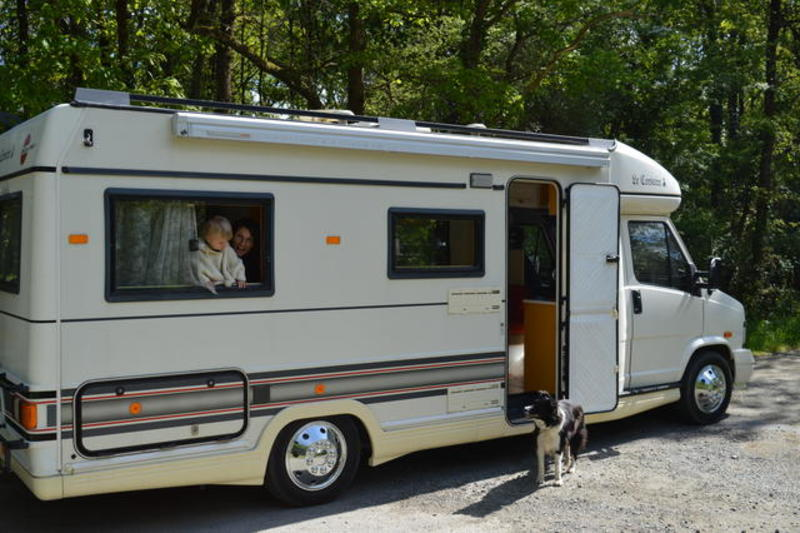
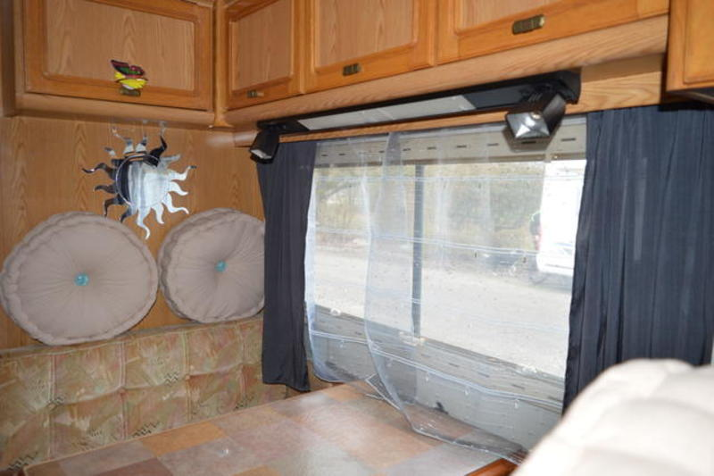
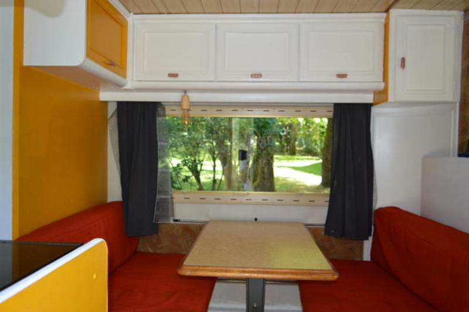
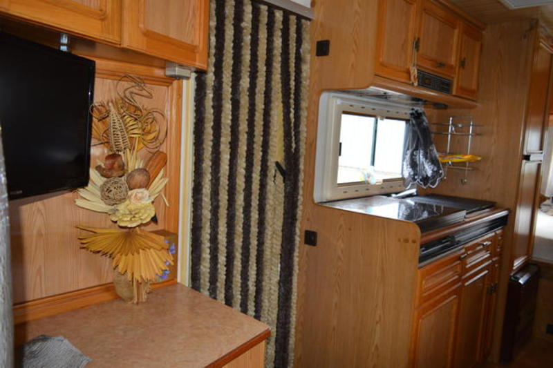
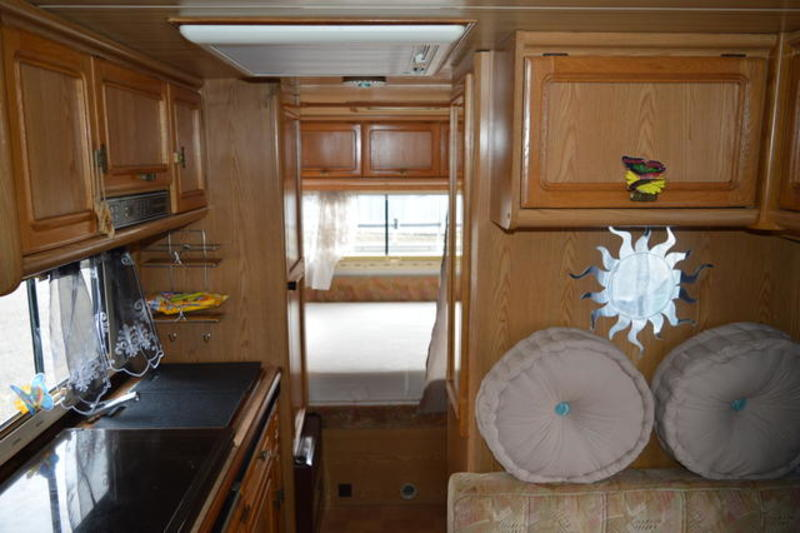
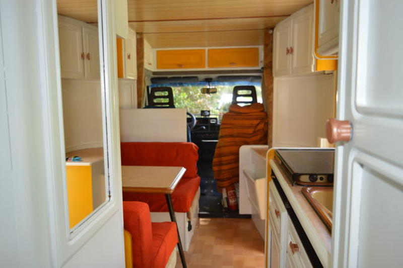

#Rénovation d'un camping car / photos & cie

En mai 2018 [nous annoncions](https://www.facebook.com/wollfthomas/posts/587067824999102) notre départ pour une période nomade à durée indéterminée, en famille, en France et au delà. Les travaux sur le camping car avaient débuté en mars 2018. Et finalement très peu étaient au courant quand nous sommes partis.

Nous souhaitions vous partager ces quelques photos de comment nous avons transformé la base de l'intérieur. Nous avons acheté un vieux camping car *Bürstner* de *1992*. Rénover l'intérieur était un beau défi et une phase précieuse pour nous aider à nous projeter et préparer ensemble le départ. Tout comme apprendre la mécanique ensemble au fur et à mesure. 

*Ambiance un mois avant le départ*

##Le salon - la table
> Poncé,une bonne sous-couche fixatrice, des peintures dont une bombe de peinture bronze pour les boutons, tissus rouge et couture, électricité pour passer de leds en *12v* à l'ampoule à filament à *230v*.

##Sur le côté avec le coin cuisine

##Sept mètres cinquante de longueur

##Montage du lit en mezzanine pour notre petit fille Naomi

Naomi était agée d'1 an au moment du départ. Le tutoriel de montage du lit est présenté sur le blog de Caroline: lire son article [le sommeil de l'enfant en itinérance](https://medium.com/moosebycaro/le-sommeil-de-lenfant-en-itin%C3%A9rance-32cf812f6d27)

## Astuces

###Poncer & sous-couche fixatrice

> Peindre nous a pris moins de temps que ... poncer. Nous avons poncé au moins 3 fois chaque surface de bois vernis. Puis lorsque toute trace du vernis avait disparu nous avons pris soin d'y mettre une sous-couche fixatrice. Puis c'était enfin le temps de la peindre. 

###10 jours de travaux pour l'intérieur
Des journées complètes uniquement pour l'intérieur, hors réflexion du choix des matériaux. Comprendre la mécanique nous aura pris du temps même si nous avons appris la plupart au fur et à mesure du voyage. 

##Particularité

Le camping car est pensé pour être une merveille pour enfant. Naomi était âgée d'un an au début des travaux - c'est à dire 3 mois avant le départ - et le camping car a aussi été aménagé pour elle, de manière à faciliter les apprentissages autonomes, la motricité, les jeux, la collaboration.

Pour en savoir plus je vous invite à explorer les articles de Caroline:[*"Moose, une maison à quatre roues" Récits d'expériences nomades avec un jeune enfant*](https://medium.com/moosebycaro).

Amitiés, 

Thomas

