Une année d'itinérance en famille
===

Vous venez peut être de le découvrir: voilà 12 mois que nous voyageons en famille à travers la France & les bordures. Lorsque nous sommes partis en mai dernier *Naomi* était âgée d'1 an. Aujourd'hui elle a 2 ans. 

Et c'était une très bonne idée, pour tout le monde, de prendre la route \o/. 

Créer sa maison sur roues
---

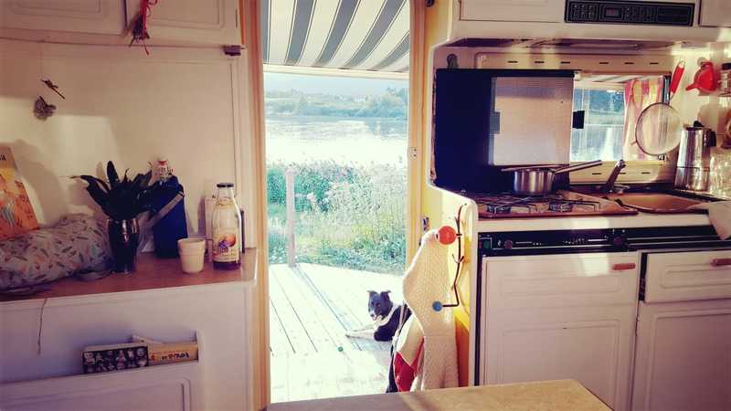
*↑Juillet 2018. Deux mois après le départ. Poupou (notre chienne de Berger) profite.*

*↑Août 2018. Papa travaille sur les Aires marines éducatives, Naomi reçoit une baleine.*

*↑Mars 2018. Deux mois avant le départ. "Y'a fashion police" comme dirait Alyssa.*

*↑Deux semaines avant le départ. Voir l'article [rénovation du camping car](http://twolff.fr/renovation-camping-car).*

L'option grands espaces - idéal quand il fait beau
---

*↑Juillet 2018: Col de la Biche à la tombée de la nuit pour une soirée avec Christophe et Juliette.*

*↑Le off: si tu penses qu'elles sont pacifiques c'est que t'as pas passé la nuit partout.*

### Le travail & les grands espaces

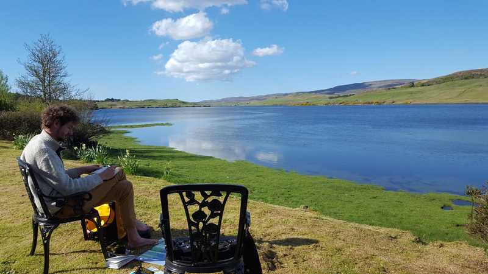
*↑S'il fait beau soit tu vas travailler en pleine nature, soit tu t'installes dehors.*

### Naomi & les grands espaces

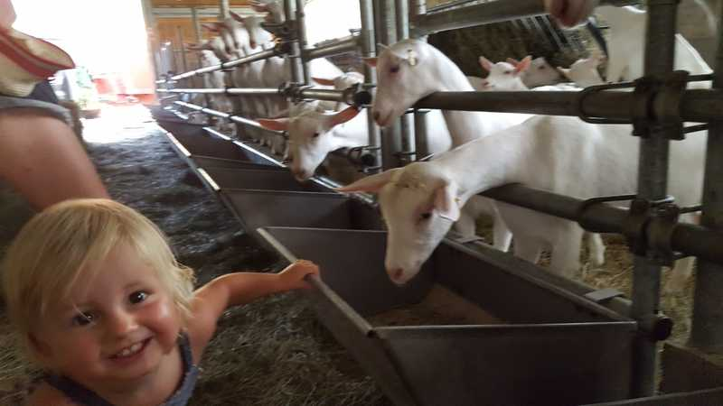
*↑Wéééééé des chèvres*

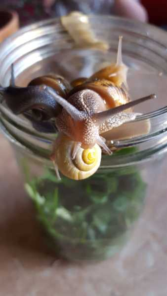
*"Et s'il pleut tu peux même re-fabriquer l'ancrêtre de la télé"*

[Découvrir les articles de blog de Caro: "Voyager avec un jeune enfant](https://medium.com/moosebycaro)

### En couple & les grands espaces

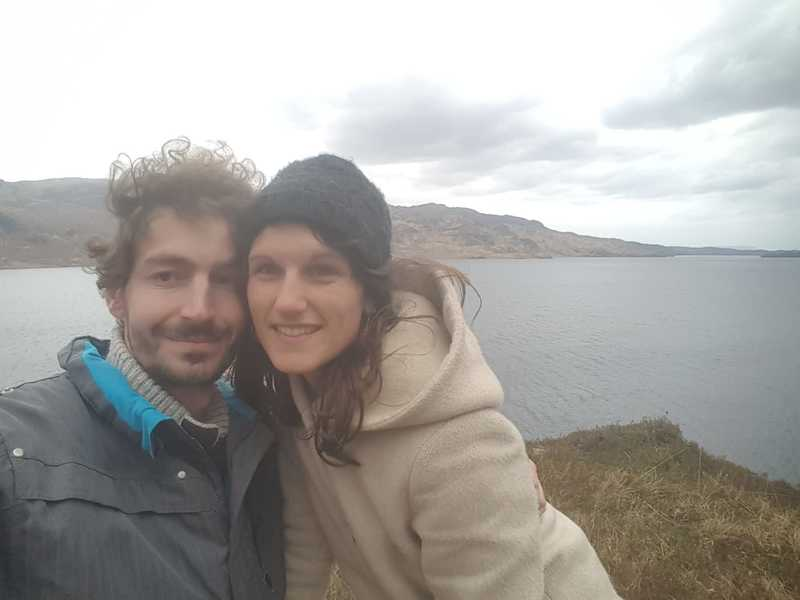
*↑Respirer*

L'option village
---

### Comment nous choisissons les villages, dans le désordre 

* les villages qui portent des noms de fromage (on est balèzes à ce jeu là)
* les villages où vivent les amis, la famille
* les villages où l'on a lancé des projets
* les plus beaux villages de france
* les villages dans des écrins de nature

*↑Juillet 2018: Village  Grande Rivière (Jura)*
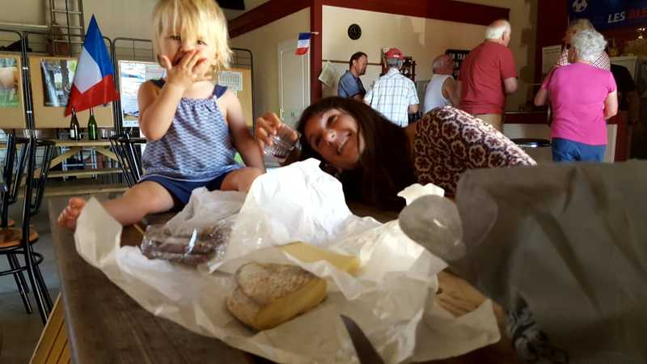
*↑Septembre 2018, quelque part vers le plateau des 1000 vaches. Toujours l'art de se retrouver dans des fêtes de village: ici une des nombreuses fêtes du fromage.*

### Côté travail & village

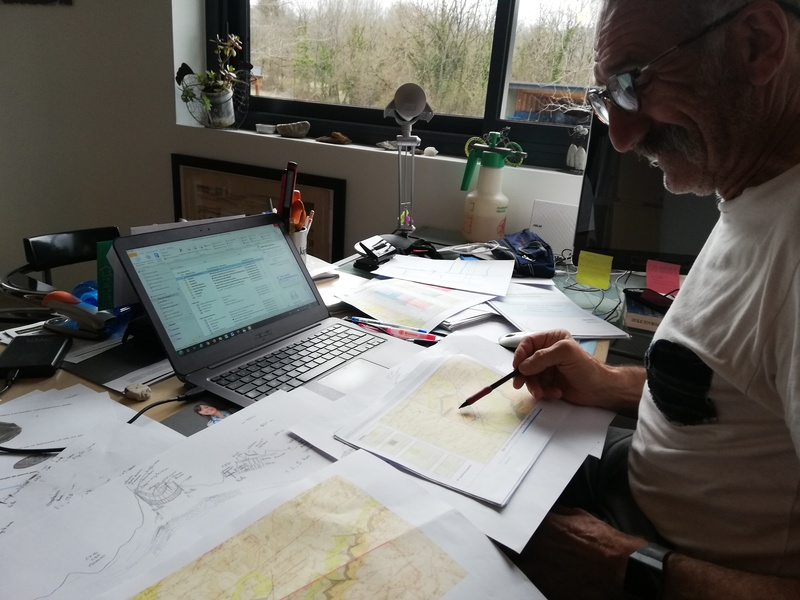
*↑La journée au village de Saint Lupicin avec un hydrogéologue, la nuit au lac d'Etival*

> Passer le moins possible de temps sur l'ordinateur et le plus de temps possible à écouter. Remplacer les aller-retours d'e-mails par des repas ou des thés, ou un échange téléphonique où l'on essaye vraiment de créer quelque chose. Pour télétravailler dans un café je mets un casque sur les oreilles et quand je suis de nouveau open je l'enlève et travaille sur carnet papier. Notre joker c'est *Poupou*, notre chienne de berger qui est mignogne et qui ne met pas longtemps avant d'aller jouer avec tout le monde. Si on a de la chance notre fin de journée finit autour d'un verre où l'on écoute les histoires. 

### Côté jeune enfant & village

*↑Joli espace jeu dans une maison de la nature*

**Si va pleuvoir durant les prochains jours et que tu es à garé à moins de 1km à pied de 2 de ces lieux t'as le jackpot:**

* piscine avec des commentaires *qui disent que l'eau est bien chaude* (youhou)
* médiathèque
* ludothèque

### Côté couple & village

*↑La vallée de la Loue, un des endroits qu'on a adoré en couple.*

### Côté famille

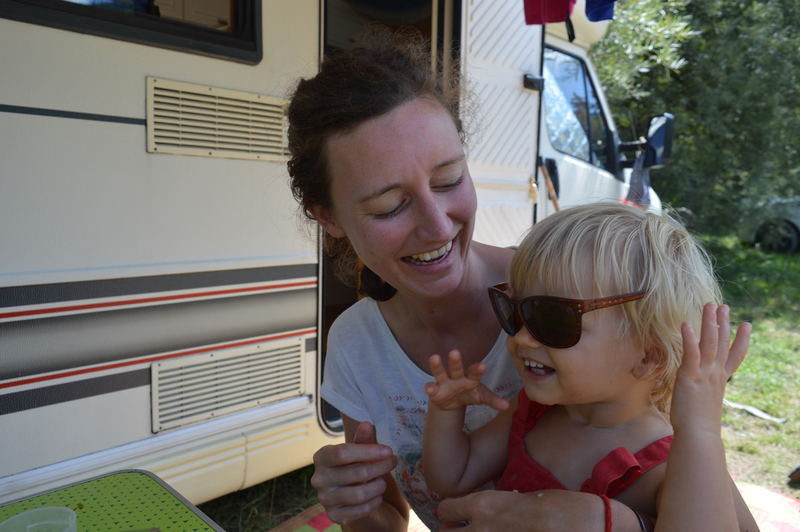
*↑Septembre 2018: Tata Hélène débarque pour quelques jours dans les Alpes*

L'option "les grandes villes"
---

### Un mois d'R'bnb à Rennes du coup on en profite

*↑Janvier 2019: Caroline a passé de nombreuses années à Rennes. Du coup: amies-amies.*
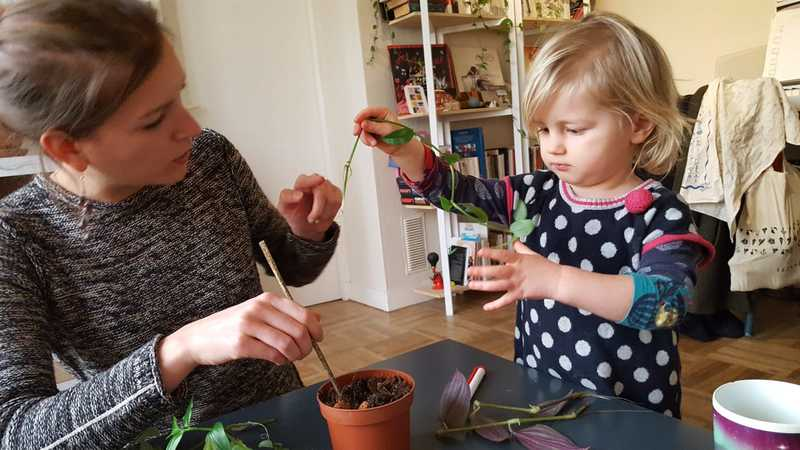
*↑Février 2019: Tata Milie et tonton Xav apprennent à Naomi à faire des boutures*

L'option "demande à ta fille de quels animaux elle aimerait s'occuper et montre lui les photos"
---

Il y a beaucoup de personnes qui sont des endroits magnifiques et qui aimeraient partir en vacances: c'est le principe du home-sitting. Bref: si tu gardes un Saint Bernard qui s'appelle Marley ou des Alpagas t'as aussi le droit de garder la grande maison qui va avec et d'inviter du monde. 

### Été, les Alpages

*↑Été 2019: l'ami Marley, un bébé Saint Bernard (véridique)*
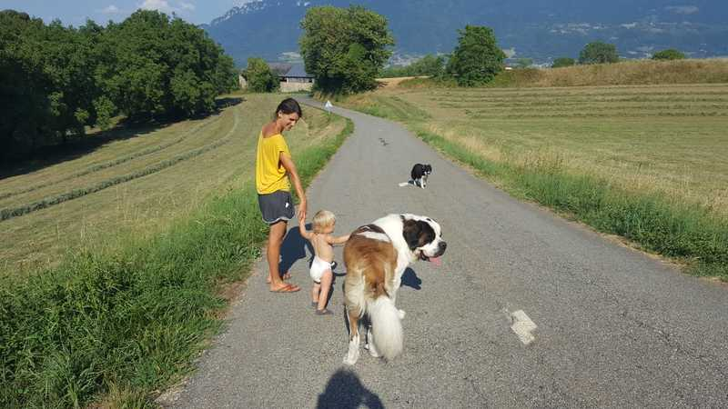
*↑Été 2019: un cadre incroyable. Les amis, collègues, ... étaient aussi de passage.*

### Hiver, campagne de la Bourgogne
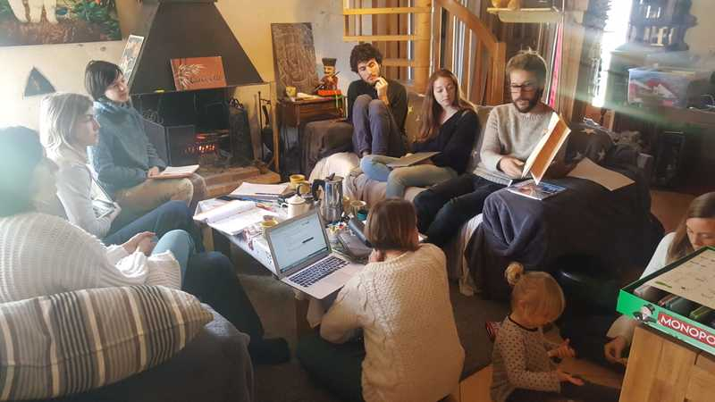
*↑Mars 2019: session de travail à Arquian (Bourgogne).*
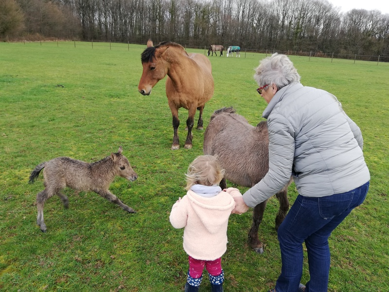
*↑Mars 2019: la voisine qui présente un poulain à Naomi. On gardait une ferme avec 3 alpagas, 25 poules, 3 ponnettes, 3 chats, ...*

L'option "quand tu peux plus emmener ta maison avec toi" 
---

*↑Accident de camping car soit disant "irrépable". Migration temporaire*

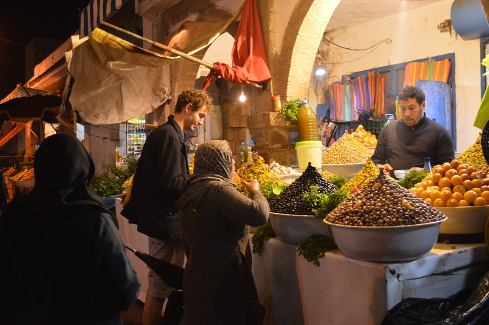

*↑Décembre 2019. Problème de soleil. On est allé voir l'ami Abdoul.*

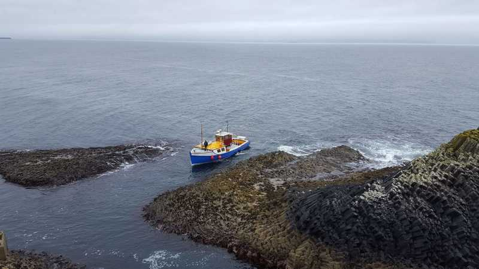

*↑Îles du Nord de l'Écosse. 2 heures de bâteau.*

Le portrait chinois revisité
===

### Le plus surprenant

> On a presque rien et on vit super bien. Ce qui me manque pour être au top c'est un four et une vraie douche. 
**Caroline**

> Le temps s'est ralenti. Cette année est passée comme peut être ... les 2-3 années précédentes. J'ai l'impression qu'on est partis il y a 2 ans. Le rapport au temps est étrange quand même. **Thomas**

### Le moment le plus drôle

> La fois où Naomi a été super vexée parce qu'elle s'est fait cracher dessus par un des alpagas qu'on gardait. On a dû la réconforter malgré les larmes de rire qu'on essayait de retenir.  **Caroline**

> Quand on a été accueilli pour la garde de la maison dans les Alpes et qu'on a rencontré Marley (le saint-bernard de presque 100kg). On a cru qu'il allait gober notre chien tout cru et la propriétaire a dit "non il est tout gentil" alors qu'il se déchênait et que j'ai du le plaquer au sol. **Thomas**

### Le moment What the fuck

> Toutes les fois où je me suis fait applaudir et encouragé par des mecs parce que je conduisais le camping car ... **Caroline**

> Il y a toujours un truc qui merde au moment des grands départs. C'est genre une loi. Si t'es en hiver et qu'il fait -5°C tu peux compter sur le fait que ta bouteille de gaz va lacher un samedi soir et qu'il y a rien d'ouvert un dimanche. Ou encore: dans les premiers départs si tu es bien isolé ton camping car ne démarre plus parce qu'il y a un problème de batterie. Et (une petite dernière), après une année, quand tu te dis "non mais on est quand même bien rodés": tu trouves un endroit sublime, isolé, avec une vue magnifique. Et là tu tournes la clé pour te garer et ... le moteur ne s'arrête pas. Si si c'est possible. **Thomas**

### Le moment où on a eu le plus peur 
> La fois où on a descendu le col de la biche et où on a cru que les freins avaient brulé et le camping car avec. **Caroline**

> La descente du col de la biche: grave, ça crêpitait. **Thomas**

### Le moment où on a le plus appris sur nous

> Tous ces moments où il y a eu des galères mécaniques. En couple avec un jeune enfant quand le garagiste te dit "votre camping car est irréparable" et que t'es paumé en pleine nature t'as les deux parents qui ont des ailes qui poussent et qui bougent ensemble le monde. La collaboration en couple naturelle et instinctive dans ces moments là m'a beaucoup appris. La routine de la ville, qui te fournit presque tout, ne t'offre finalement pas tant d'occasions de collaborer que ça que ce soit en couple ou avec tes voisins. C'est un confort qui a des impacts secondaires. **Thomas**

> Le fait d'être aussi à l'aise dans un si petit espace au quotidien. **Caroline**

### Le plus amusant au quotidien

> Se réveiller dans des lieux différents tout le temps et que si ça plait pas on peut changer. **Caroline**

> C'est l'alternance de mondes. C'est par exemple de passer en moins de 2 heures d'un réveil pieds nu dans la nature à présenter un projet dans les salons "dorés" d'une Préfecture de Région. **Thomas**

### Le plus difficile au quotidien

> Etre nulle en cartographie et en orientation...le savoir, essayer que ca change, et constater que c'est pas beaucoup mieux au bout d'un an..! **Caroline**

> Les jours de mauvais temps ne pas savoir si je vais avoir de bonnes conditions pour travailler. **Thomas**

### Le plus agréable au quotidien

> Être ensemble, en famille, prendre le temps d'avoir le temps d'apprécier les choses simples: lire, écrire, regarder ensemble les hirondelles, rigoler, inventer des rituels à l'extérieur pour clore les journées bien riches. Avoir le temps et être ensemble: c'est ça. **Thomas** 

> Tous les matins à 3 dans notre "cocon". Ca commence par un réveil ou de deux dans le lit on passe vite à trois, puis le ptit dej' avec quasi-systématiquement le chant des oiseaux pour nous accompagner, l'odeur du café, les sourires de Naomi et nos cheveux ébouriffés. **Caroline**

### Ce qui nous manque le plus au quotidien

> M'échapper et créer avec ma machine à coudre. De manière générale avoir plus de moments que pour moi. **Caroline**

> Pouvoir rejoindre facilement un marché avec pleinnn de bons légumes. Sans avoir à faire une manoeuvre de fou qui prend 2 places dans un endroit où ils roulent comme des dingues pour une raison qui m'échappe puisqu'on est dimanche. **Thomas**

### La suite? 

> Surprise.

